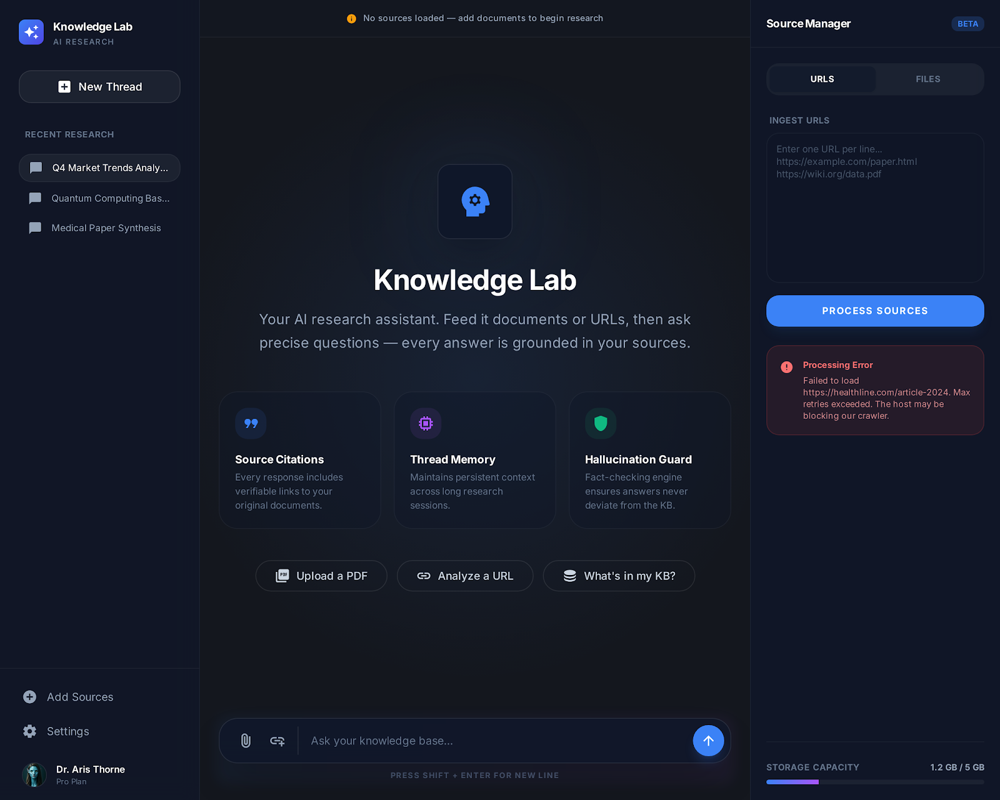

# 🧠 CiteFlow: Local-First Research OS

> **A production-ready RAG pipeline featuring Hybrid Search (BM25 + Vector), Cross-Encoder Re-ranking (FlashRank), and a Persistent Knowledge Base (ChromaDB).**



## 🚀 Why This Matters
Most RAG (Retrieval-Augmented Generation) tutorials stop at "chat with a PDF." **CiteFlow** bridges the gap to enterprise-grade search systems by implementing a 3-stage retrieval architecture:

1.  **Broad Recall:** Semantic Search (Vector) + Keyword Search (BM25).
2.  **Precision:** Reciprocal Rank Fusion (RRF) to combine results.
3.  **Accuracy:** Cross-Encoder Re-ranking (FlashRank) to filter hallucinations.

All built on a **local-first** stack using **Docker**, **FastAPI**, and **React**.

## 🚀 Key Features (Expert Level)

*   **⚡ Hybrid Search & Re-ranking**: Combines **BM25** (Keyword) and **Vector Search** (Semantic) with a **FlashRank** re-ranking step for superior retrieval accuracy.
*   **🧠 Persistent Memory**: Utilizes **ChromaDB** to store knowledge permanently, ensuring your research threads and indexed documents survive server restarts.
*   **🐳 Dockerized Deployment**: Fully containerized with a multi-stage **Docker** build for the frontend and an optimized backend image, orchestrated via **Docker Compose**.
*   **🎨 Modern Research UI**: Features a dual-view interface (Dashboard & Chat), Light/Dark themes, and a responsive Sidebar for managing research threads.
*   **⚙️ Advanced Controls**: User-configurable retrieval parameters (Top-K, Temperature) via a sleek settings modal.

## 🏗️ Architecture

```mermaid
graph TD
    User([User]) -->|Query| Frontend[React Frontend]
    Frontend -->|Uncertainty Estimation| API{FastAPI Backend}
    
    subgraph "Knowledge Pipeline"
        API -->|1. Hybrid Retrieval| Retriever[Ensemble Retriever]
        Retriever -->|Semantic| VS[(ChromaDB - Vector)]
        Retriever -->|Keyword| BM25[(BM25 - Sparse)]
        VS -- Top 20 --> Fusion[Reciprocal Rank Fusion]
        BM25 -- Top 20 --> Fusion
    end
    
    subgraph "Cognitive Layer"
        Fusion -- Candidates --> Ranker[FlashRank Cross-Encoder]
        Ranker -- Top 5 Relevant --> LLM[LLM (OpenRouter)]
        LLM -->|Contextual Answer| API
    end
    
    subgraph "Infrastructure"
        Docker[Docker Compose] --> API
        Docker --> Frontend
    end
```

## 🛠️ Tech Stack

*   **Frontend**: React, Vite, Lucide Icons, CSS Variables (Theming)
*   **Backend**: Python, FastAPI, LangChain
*   **AI/ML**: ChromaDB, Rank-BM25, FlashRank, HuggingFace embeddings
*   **Infrastructure**: Docker, Nginx

## 📦 Installation & Setup

### Option 1: Docker (Recommended)

1.  Clone the repository.
2.  Create a `.env` file in `backend/` based on `.env.example`.
3.  Run:
    ```bash
    docker-compose up --build
    ```
4.  Open `http://localhost` in your browser.

### Option 2: Local Development

**Backend:**
```bash
cd backend
pip install -r requirements.txt
uvicorn main:app --reload
```

**Frontend:**
```bash
cd frontend
npm install
npm run dev
```
